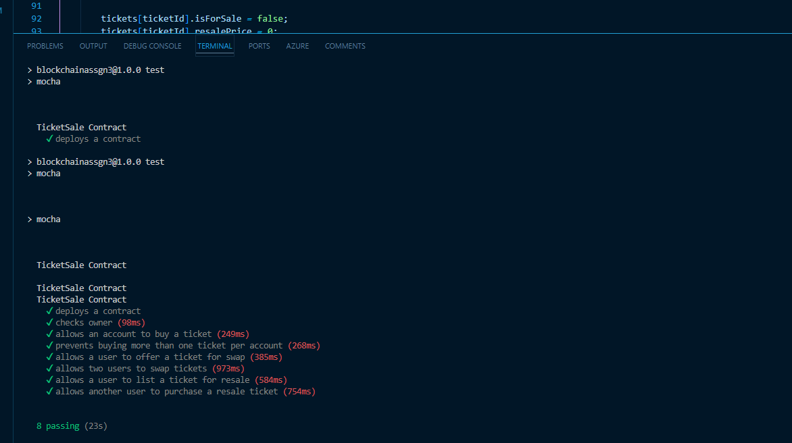

# Bikash Acharya
# Ticket Sale Smart Contract

This project implements a smart contract for managing ticket sales, swaps, and resales. The contract allows users to buy tickets, safely swap tickets with other users, and resell tickets with a 10% service fee, which goes to the contract owner.

## Project Structure

- **contracts/**
  - `TicketSale.sol`: The Solidity contract file implementing the ticket sale functionality.
- `compile.js`: Script to compile the Solidity contract and generate ABI and bytecode.
- **test/**
  - `TicketSale.test.js`: Contains test cases for each function in the smart contract.
- **pictures/**
  - `testcases.png`: Screenshot showing that all test cases have passed.

---

## Requirements

- **Node.js** and **npm** with node 16.20.2
- **Ganache-cli** (for local Ethereum blockchain) 6.12.2
- **Web3.js**, 1.0.0-beta.26  **solc** 0.8.17, and **@truffle/hdwallet-provider** latest version packages

---

## Installation

1. Clone the repository and navigate into the project folder:

    ```bash
    git clone <repository_url>
    cd <project_folder>
    ```

2. Install dependencies:

    ```bash
    npm install
    ```

---

## Usage

### 1. Compile the Contract

Run the following command to compile the contract:

```bash
node compile.js
```

This will generate the ABI and bytecode for the contract in the console. Or When you run the test it will print the values

- **ABI**: The Application Binary Interface (ABI) defines the structure of the contract's functions and events. Place the ABI in the designated section below.
- **Bytecode**: The bytecode is the compiled code that the Ethereum Virtual Machine (EVM) can execute. Place the bytecode in the designated section below.


### 2. Run Tests

To test the contract, start Ganache and run:

```bash
npm run test
```

This will execute the tests in `TicketSale.test.js` to verify the functionality of each contract function.

---

## Smart Contract

### Constructor

```solidity
constructor(uint numTickets, uint price)
```

Initializes the contract with a specified number of tickets (`numTickets`) and a ticket price (`price`). The contract deployer becomes the owner.

### Functions

- **buyTicket(uint ticketId)**: Allows a user to purchase a ticket if it’s available and the correct price is paid.
- **getTicketOf(address person)**: Returns the ticket ID owned by the specified address or `0` if none.
- **offerSwap(uint ticketId)**: Submits a swap offer for the sender's ticket.
- **acceptSwap(uint ticketId)**: Allows another user to accept a swap offer if conditions are met.
- **resaleTicket(uint price)**: Lists a ticket for resale at a specified price.
- **acceptResale(uint ticketId)**: Allows a user to buy a resale ticket if conditions are met, with a 10% fee going to the owner.
- **checkResale()**: Returns the list of tickets available for resale.

---

## ABI and Bytecode

After running `compile.js`, paste the generated ABI and bytecode below:

### ABI

```json
[
  {
    inputs: [ [Object], [Object] ],
    stateMutability: 'nonpayable',
    type: 'constructor'
  },
  {
    inputs: [ [Object] ],
    name: 'acceptResale',
    outputs: [],
    stateMutability: 'payable',
    type: 'function'
  },
  {
    inputs: [ [Object] ],
    name: 'acceptSwap',
    outputs: [],
    stateMutability: 'nonpayable',
    type: 'function'
  },
  {
    inputs: [ [Object] ],
    name: 'buyTicket',
    outputs: [],
    stateMutability: 'payable',
    type: 'function'
  },
  {
    inputs: [],
    name: 'checkResale',
    outputs: [ [Object] ],
    stateMutability: 'view',
    type: 'function'
  },
  {
    inputs: [ [Object] ],
    name: 'getTicketOf',
    outputs: [ [Object] ],
    stateMutability: 'view',
    type: 'function'
  },
  {
    inputs: [],
    name: 'numTickets',
    outputs: [ [Object] ],
    stateMutability: 'view',
    type: 'function'
  },
  {
    inputs: [ [Object] ],
    name: 'offerSwap',
    outputs: [],
    stateMutability: 'nonpayable',
    type: 'function'
  },
  {
    inputs: [],
    name: 'owner',
    outputs: [ [Object] ],
    stateMutability: 'view',
    type: 'function'
  },
  {
    inputs: [ [Object] ],
    name: 'ownerToTicket',
    outputs: [ [Object] ],
    stateMutability: 'view',
    type: 'function'
  },
  {
    inputs: [ [Object] ],
    name: 'resaleTicket',
    outputs: [],
    stateMutability: 'nonpayable',
    type: 'function'
  },
  {
    inputs: [ [Object] ],
    name: 'resaleTickets',
    outputs: [ [Object] ],
    stateMutability: 'view',
    type: 'function'
  },
  {
    inputs: [ [Object] ],
    name: 'swapOffers',
    outputs: [ [Object] ],
    stateMutability: 'view',
    type: 'function'
  },
  {
    inputs: [],
    name: 'ticketPrice',
    outputs: [ [Object] ],
    stateMutability: 'view',
    type: 'function'
  },
  {
    inputs: [ [Object] ],
    name: 'tickets',
    outputs: [ [Object], [Object], [Object], [Object] ],
    stateMutability: 'view',
    type: 'function'
  }
]
```

### Bytecode

```
a760008301876110e5565b6111b46020830186611168565b6111c16040830185611183565b6111ce60608301846110e5565b95945050505050565b60006020820190506111ec6000830184611168565b92915050565b600081519050919050565b600082825260208201905092915050565b6000819050602082019050919050565b611227816110db565b82525050565b6000611239838361121e565b60208301905092915050565b6000602082019050919050565b600061125d826111f2565b61126781856111fd565b93506112728361120e565b8060005b838110156112a357815161128a888261122d565b975061129583611245565b925050600181019050611276565b5085935050505092915050565b600060208201905081810360008301526112ca8184611252565b905092915050565b600082825260208201905092915050565b7f4e6f2073776170206f6666657220657869737473000000000000000000000000600082015250565b60006113196014836112d2565b9150611324826112e3565b602082019050919050565b600060208201905081810360008301526113488161130c565b9050919050565b7f596f7520646f206e6f74206f776e2061207469636b6574000000000000000000600082015250565b60006113856017836112d2565b91506113908261134f565b602082019050919050565b600060208201905081810360008301526113b481611378565b9050919050565b7f496e76616c696420706172746e65720000000000000000000000000000000000600082015250565b60006113f1600f836112d2565b91506113fc826113bb565b602082019050919050565b60006020820190508181036000830152611420816113e4565b9050919050565b7f596f7520646f6e2774206f776e2074686973207469636b657400000000000000600082015250565b600061145d6019836112d2565b915061146882611427565b602082019050919050565b6000602082019050818103600083015261148c81611450565b9050919050565b7f496e76616c6964207469636b6574204944000000000000000000000000000000600082015250565b60006114c96011836112d2565b91506114d482611493565b602082019050919050565b600060208201905081810360008301526114f8816114bc565b9050919050565b7f5469636b657420616c726561647920736f6c6400000000000000000000000000600082015250565b60006115356013836112d2565b9150611540826114ff565b602082019050919050565b6000602082019050818103600083015261156481611528565b9050919050565b7f496e636f7272656374207061796d656e7420616d6f756e740000000000000000600082015250565b60006115a16018836112d2565b91506115ac8261156b565b602082019050919050565b600060208201905081810360008301526115d081611594565b9050919050565b7f416c7265616479206f776e2061207469636b6574000000000000000000000000600082015250565b600061160d6014836112d2565b9150611618826115d7565b602082019050919050565b6000602082019050818103600083015261163c81611600565b9050919050565b7f5469636b6574206e6f7420666f7220726573616c650000000000000000000000600082015250565b60006116796015836112d2565b915061168482611643565b602082019050919050565b600060208201905081810360008301526116a88161166c565b9050919050565b7f4e487b7100000000000000000000000000000000000000000000000000000000600052601260045260246000fd5b7f4e487b7100000000000000000000000000000000000000000000000000000000600052601160045260246000fd5b6000611718826110db565b9150611723836110db565b925082611733576117326116af565b5b828204905092915050565b6000611749826110db565b9150611754836110db565b925082820390508181111561176c5761176b6116de565b5b92915050565b7f4e487b7100000000000000000000000000000000000000000000000000000000600052603260045260246000fd5b7f4e487b7100000000000000000000000000000000000000000000000000000000600052603160045260246000fd5b60006117db826110db565b91507fffffffffffffffffffffffffffffffffffffffffffffffffffffffffffffffff820361180d5761180c6116de565b5b60018201905091905056fea264697066735822122045c1be6405fa9437f27e049837a2de1be7e3d57ca8d65ee17203c204002eee4964736f6c63430008110033
```

---

## Test Case Results

Below is a screenshot showing that all test cases have passed.



---

--- 

